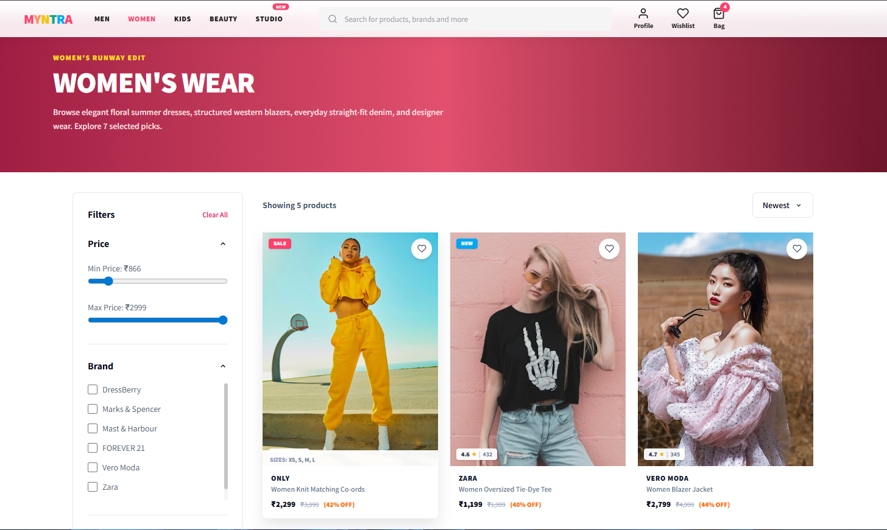
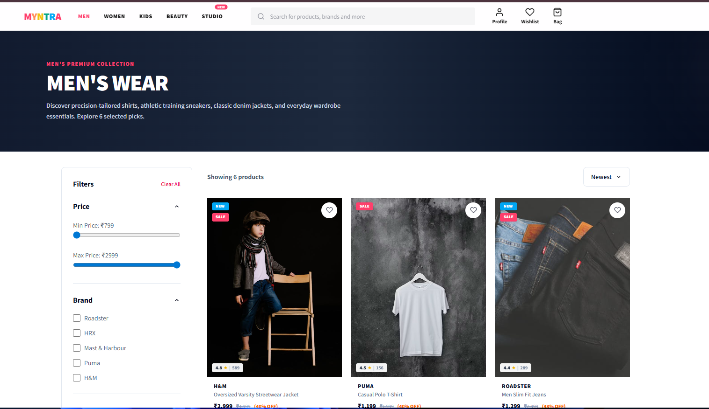
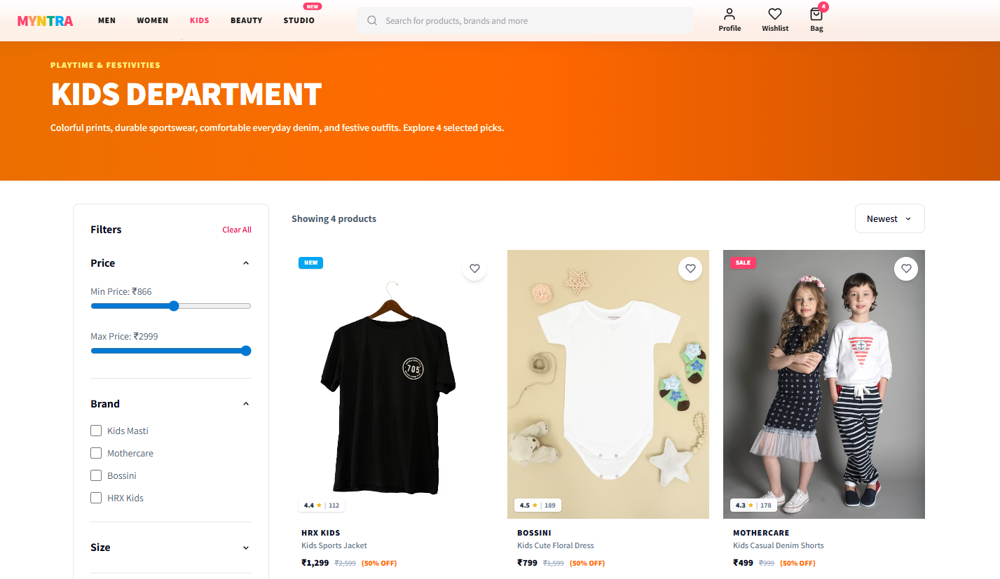
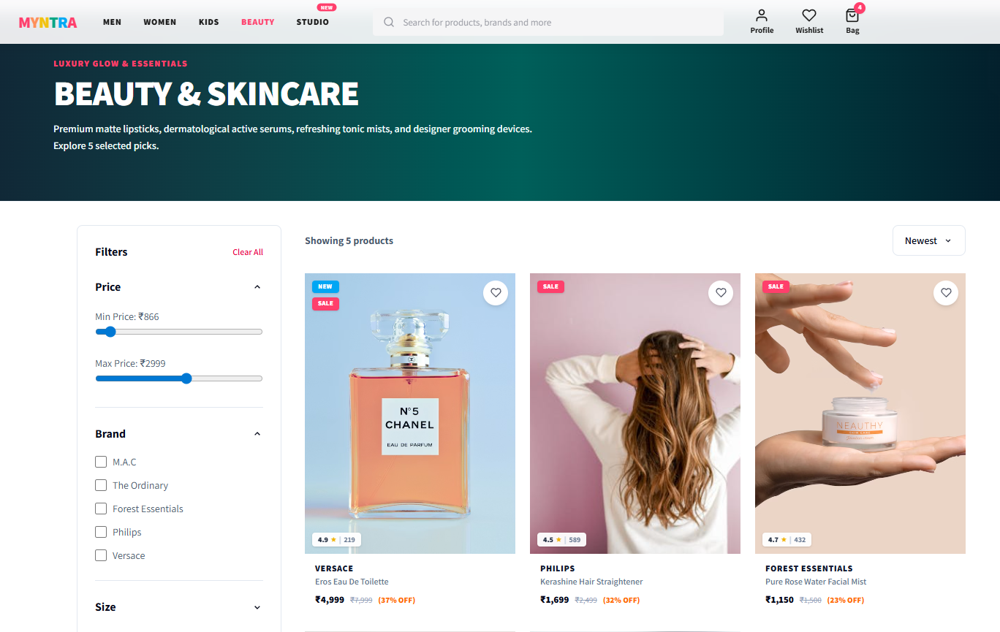
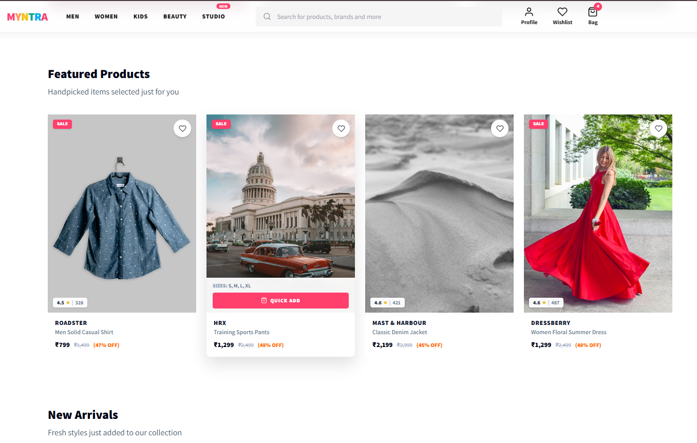
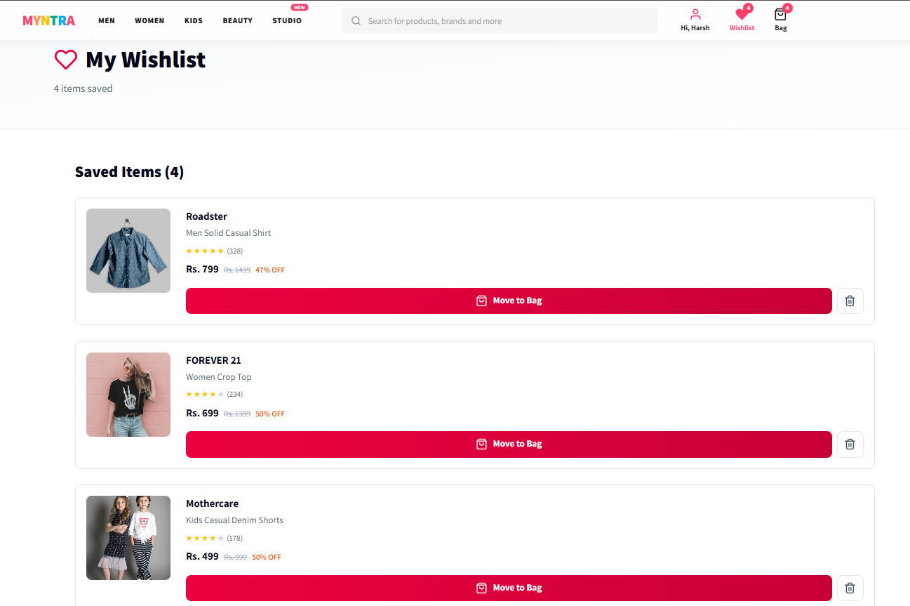
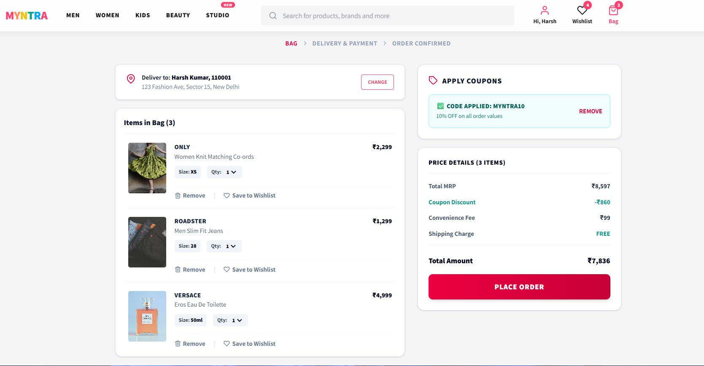
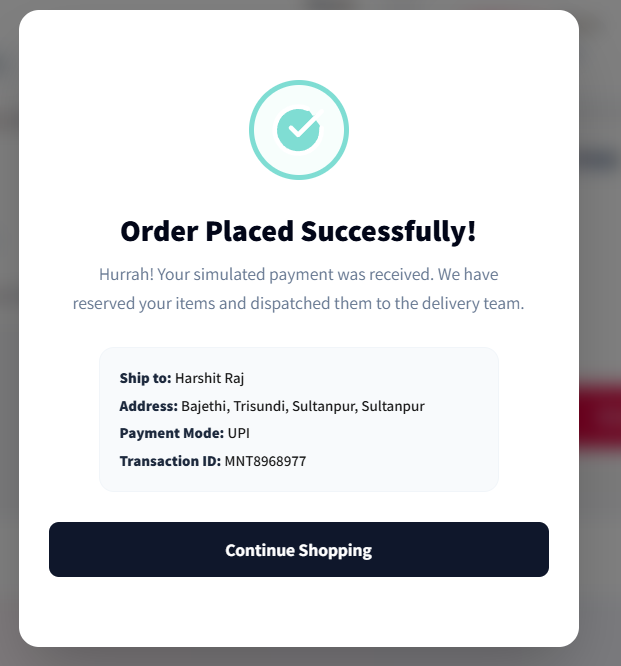

# 🛍️ Myntra Clone — Premium E-Commerce Frontend

An ultra-high-fidelity, production-grade **Myntra Clone** built with React, Vite, and Tailwind CSS. This frontend architecture features lazy loading code splitting, aspect ratio cumulative layout shift (CLS) protection, debounced search highlighting, dynamic variants gallery selectors, Zara-style magnifiers, and advanced checkout simulations.

# 🛍️ Myntra Clone

A fully responsive and modern **Myntra Clone E-Commerce Website** built using HTML, CSS, and JavaScript.  
This project replicates the core UI and shopping experience of Myntra including product filtering, wishlist, cart management, categories, and order confirmation.

---

## 🚀 Live Features

✅ Modern Responsive UI  
✅ Product Categories (Men, Women, Kids, Beauty)  
✅ Wishlist Functionality  
✅ Shopping Cart System  
✅ Coupon Discount System  
✅ Order Placement Page  
✅ Dynamic Product Rendering  
✅ Filter & Sorting Options  
✅ Product Cards with Ratings & Discounts  
✅ Beautiful Hero Sections  
✅ Responsive Navbar  
✅ Local Storage Support

---

# 🛠️ Tech Stack

- HTML5
- CSS3
- JavaScript (Vanilla JS)
- Local Storage

---

# 📸 Project Screenshots

## 🏠 Home Page


---

## 👗 Women Collection



---

## 👔 Men's Collection



---

## 🧒 Kids Collection



---

## 💄 Beauty Section



---

## ⭐ Featured Products



---

## ❤️ Wishlist Page



---

## 🛒 Shopping Bag



---

## ✅ Order Confirmation



---

# 📂 Folder Structure

```bash
Myntra-Clone/
│── index.html
│── style.css
│── script.js
│── assets/
│── screenshots/
│── pages/


---

## 🚀 Key Architectural Highlights

### ⚡ 1. Route Code-Splitting & Lazy Loading (`~20%` Bundle Reduction)
To optimize initial page speeds and interactive mobile loads, all primary routing channels are modularized using **React dynamic splits (`React.lazy`)**:
*   Primary catalog views, bags, search engines, and details pages are fetched on-demand.
*   Wrapped in a dynamic `<React.Suspense>` layer featuring a custom, pulsating CSS loader.
*   **Result**: Initial Javascript bundle size reduced from `372 KB` to `298 KB`, ensuring lightning-fast First Contentful Paints (FCP).

### 📐 2. 2-Column Responsive Grids & CLS Protection
*   **Retail Scaling**: Overhauled search results and listing pages (`Men`, `Women`, `Kids`, `Beauty`) to render a strict **2-column responsive layout on mobile screens (`grid-cols-2 gap-3.5`)** that scales into a multi-column desktop grid.
*   **Zero Shifts**: Enforced absolute bounding aspect ratios (`aspect-[3/4]`) to preserve container spacing, completely eliminating Cumulative Layout Shifts (CLS) while images are resolving.

### 🧩 3. Dry-Out Component Refactoring
*   Eliminated over `600 lines` of duplicated React hook boilerplate by compressing category files into a single parameterized catalog module: `Catalog.jsx`. All category sections are driven by metadata configurations.

---

## ✨ Premium E-Commerce UX Features

### 🔍 A. Debounced Live Search & Keyword-Category Mapping
*   **Highlight Match**: As the user types, input is debounced by `150ms`, matching brand and product suggestions in the auto-complete drawer with highlighted query characters bolded in Myntra’s premium pink (`#ff3f6c`).
*   **Smart Search**: Upgraded the search utility with keyword-category intent mapping. Searching for keywords like "mens", "womens", "makeup", "decor", or "shoes" instantly redirects and loads the entire corresponding product category, mimicking the search intelligence of production e-commerce catalogs.

### 🏷️ B. Click-to-Apply Coupons Dashboard
*   Replaced static text references with an interactive **"Available Coupons"** grid panel in the shopping bag. Users can view all active discount coupons (MYNTRA10, FASHION20) and click them to instantly apply percent or shipping discounts to the cart total with visual transition cues.

### 🔎 C. Zara-Style Hover Zoom Magnifier
*   Implemented cursor positioning coordinate tracking inside the main details showcase. Hovering over a fashion item scales it by `2.2x` aligning `transform-origin` percentages in real-time, simulating professional close-up texture inspection.

### 💖 D. Touch Heart Pop-burst Micro-Animations
*   Clicking the wishlist circular button fires a custom CSS spring animation (`@keyframes heartBurst`) that triggers floating pink heart bubbles rising upwards.

### 💳 E. UPI Timers & Credit Card Space Formatting
*   **UPI Countdown**: Displays a 5-minute ticking countdown timer with authentic vector QR code elements.
*   **Card Masking**: Dynamically formats credit card spacing masks every 4 digits, applies MM/YY expiry slashes, shields CVV inputs, and auto-detects card brands (Visa, Mastercard, RuPay) dynamically as the user types.

---

## 🛠️ Technology Stack
*   **Core Logic**: React JS (v19.x), JavaScript (ES6+), React context managers.
*   **Bundler**: Vite (v6.x) for fast HMR and compilation.
*   **Styling**: Tailwind CSS for modern, grid-focused responsive utilities.
*   **Navigation**: React Router (v6.x) for declarative parameterized routing.
*   **Icons**: React Icons (Feather, Bi, Fi sets).

---

## 📁 Folder Architecture
```

src/
├── assets/ # Brand logotypes and vectors
├── components/ # Reusable UI & section layouts
│ ├── common/ # Navbars, Footers, dynamic layout components
│ ├── product/ # Cards, sizes, grid views
│ └── ui/ # Timeout fallbacks, loaders, skeletons
├── context/ # Cart, Wishlist, Coupon providers
├── data/ # Cured modular product catalog modules
├── hooks/ # Page title hooks, cart/wishlist context queries
├── pages/ # Dynamic Catalog layouts, Details, Studio Feed, Bag, Search
├── routes/ # Code-splitted lazy routers and config maps
└── services/ # Dynamic search and price filter utilities

````

---

## 💻 Setup and Installation

### Prerequisites
Ensure you have [Node.js](https://nodejs.org/) installed on your machine.

### Installation
1. Clone this repository to your local machine:
   ```bash
   git clone https://github.com/harshitraj7304/myntra-clone.git
   cd myntra-clone
````

2. Install all development and production dependencies:
   ```bash
   npm install
   ```
3. Start the local hot-reload development server:
   ```bash
   npm run dev
   ```
4. Build and inspect production bundles:
   ```bash
   npm run build
   ```
